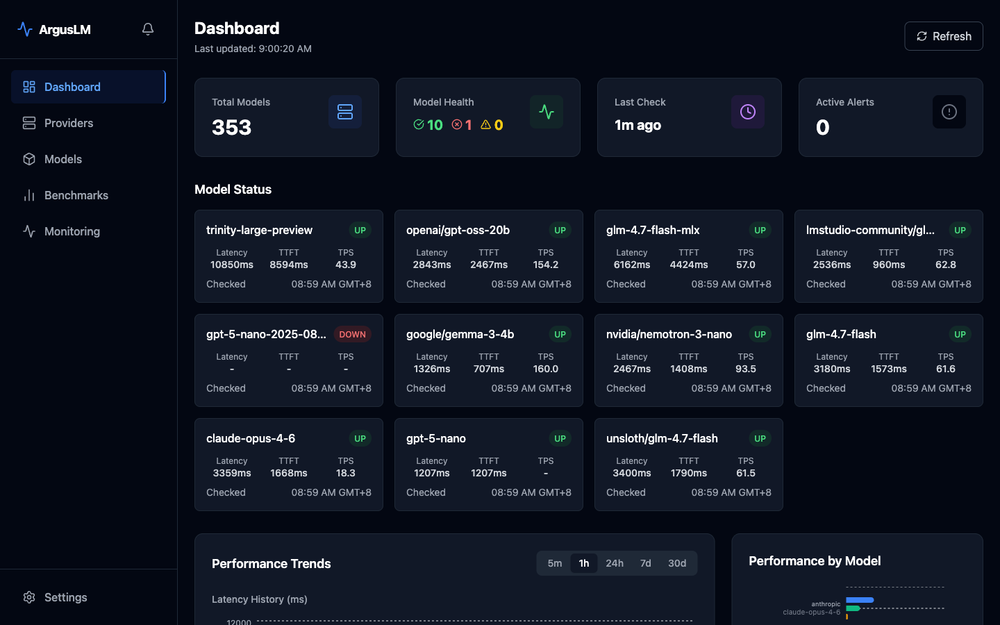
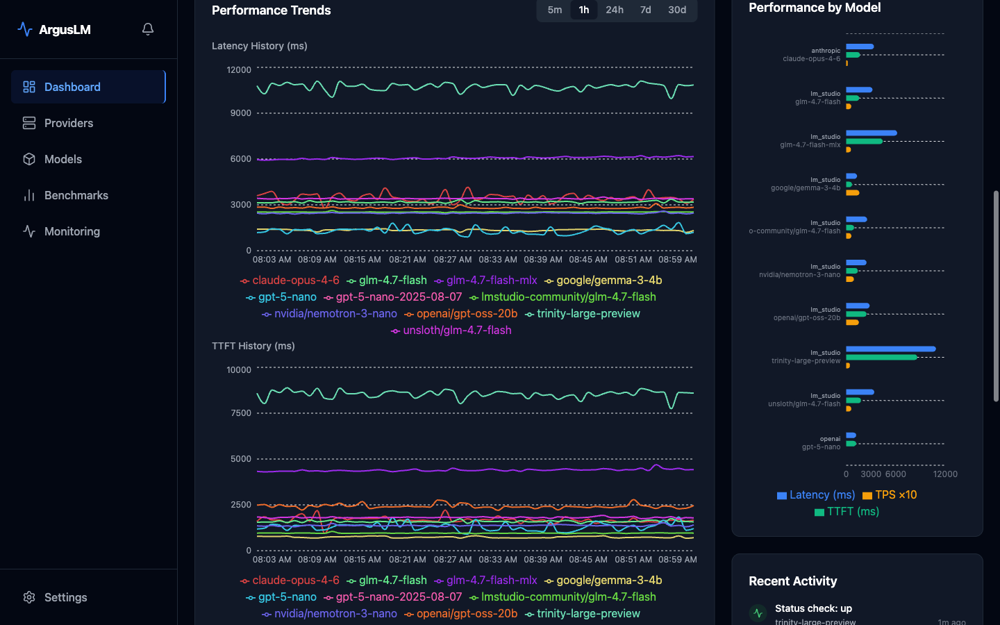
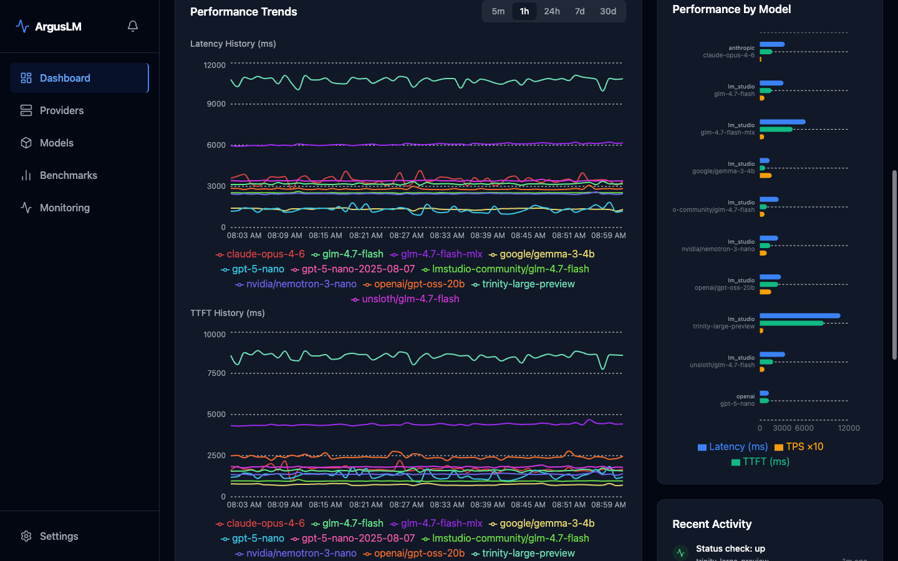
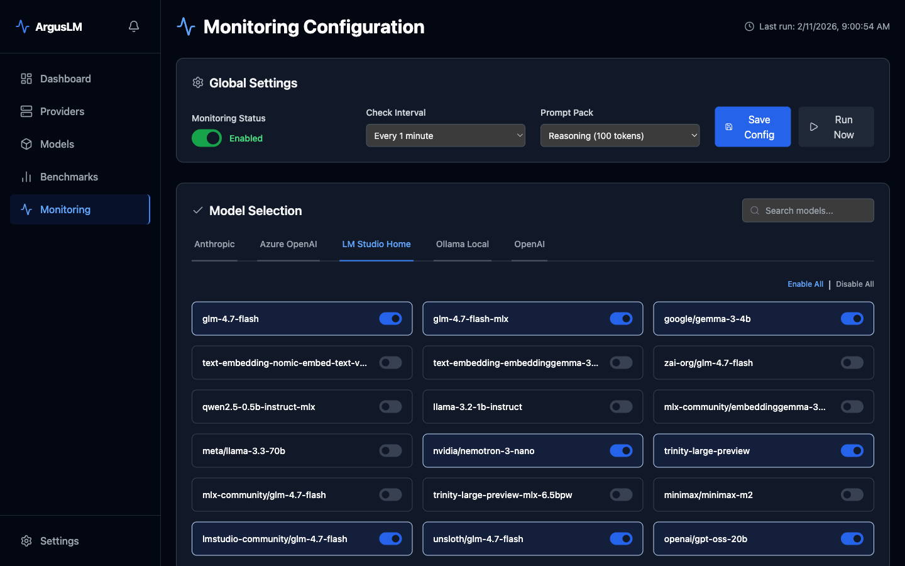
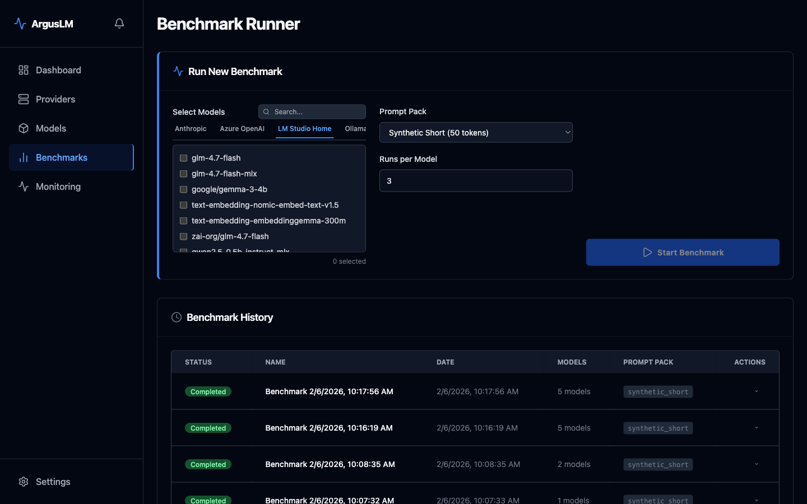

# ArgusLM — Open-Source LLM Monitoring & Benchmarking

[](https://pypi.org/project/arguslm/)
[](https://github.com/bluet/arguslm/actions/workflows/ci.yml)
[](LICENSE)
[](https://github.com/bluet/arguslm/stargazers)
[](https://www.python.org/downloads/)
[](https://hub.docker.com/r/bluet/arguslm)

> Know exactly which LLM providers are up, which are fastest,
> and which are degrading — before your users notice.



## The Problem

Modern AI architectures use dozens of LLM providers across services — OpenAI, Anthropic, Bedrock, Vertex, local Ollama, custom endpoints — each with different availability, latency, and throughput characteristics. When providers fail or slow down, you find out from support tickets, not monitoring dashboards. Existing tools are either SaaS-only (expensive, locked-in), infrastructure-focused (can't probe LLM APIs), or require complex instrumentation (changes your code).

## Why ArgusLM?

| Aspect | Datadog / Langfuse | Prometheus | LLM Overwatch | **ArgusLM** |
|--------|-------------------|-----------|---------------|-------------|
| Deployment | SaaS-only | Self-hosted | SaaS-only | Self-hosted |
| Local Models | ❌ No | ❌ No | ❌ No | ✅ Ollama, LM Studio, local APIs |
| Probing vs Tracing | Tracing only | Infrastructure only | Probing only | Synthetic probing |
| Metrics | Request-level | Node-level | Response time | TTFT, TPS, latency, uptime |
| Pricing | $$$$ | Free | $$$ | ✅ Free & Open-Source |
| Extensible | Limited | Limited | No | ✅ Full Python SDK + HTTP API |

**What makes ArgusLM unique:** The only open-source tool that actively probes any LLM provider (including local Ollama/LM Studio) for real uptime, Time to First Token (TTFT), Tokens per Second (TPS), and latency — with a unified Python SDK for custom automation.

## Use Cases

**ArgusLM is for you if:**

- **You're building production AI systems** — Monitor uptime and performance of multiple LLM providers in real-time, detect degradations before users do.
- **You run self-hosted LLM deployments** — Track local Ollama/LM Studio availability and response metrics alongside cloud providers in one dashboard.
- **You provider LLM-based services** — Know exactly which provider to route traffic to based on real performance data, not assumptions or marketing claims.
- **You need automated benchmarking** — Run scheduled comparisons between models (GPT-4 vs Claude vs local Llama) to optimize costs and quality.
- **You must keep costs private** — Self-hosted, no SaaS lock-in, full control over your observability data.

---

## Quick Start

Deploy ArgusLM in under a minute:

```bash
git clone https://github.com/bluet/arguslm.git && cd arguslm
cp .env.example .env

# Generate secrets (requires cryptography package, or use the Docker one-liner in .env.example)
python3 scripts/generate-secrets.py >> .env

docker compose up -d
```

**Dashboard**: [http://localhost:3000](http://localhost:3000)
**API Documentation**: [http://localhost:8000/docs](http://localhost:8000/docs)

---

## Features

| Category | Capabilities |
| :--- | :--- |
| Monitoring | Automated uptime checks, real-time status tracking, and configurable availability intervals. |
| Benchmarking | Parallel multi-model testing with deep metrics for TTFT, TPS, and total latency. |
| Visualization | Live performance charts, historical trends, and side-by-side model comparisons. |
| Alerting | Proactive downtime detection and performance degradation notifications. |
| Integration | 16 tested providers (OpenAI, Anthropic, Ollama, etc.) plus additional providers via LiteLLM. |

---

## Architecture

ArgusLM is built for scale and reliability, leveraging a modern asynchronous stack.

```
┌─────────────────────────────────────────────────────────────────┐
│                         ArgusLM                                 │
├─────────────────────────────────────────────────────────────────┤
│  Frontend (React + Vite)           Backend (FastAPI)            │
│  ┌─────────────────────┐           ┌──────────────────────┐    │
│  │ Dashboard           │◄─────────►│ REST API + WebSocket │    │
│  │ Benchmarks          │           │ Background Scheduler │    │
│  │ Monitoring          │           │ Alert Engine         │    │
│  │ Providers           │           └──────────┬───────────┘    │
│  └─────────────────────┘                      │                 │
│                                               ▼                 │
│                              ┌─────────────────────────────┐   │
│                              │  LiteLLM Abstraction Layer  │   │
│                              └─────────────┬───────────────┘   │
│                                            │                    │
└────────────────────────────────────────────┼────────────────────┘
                                             ▼
              ┌──────────────────────────────────────────────────┐
              │                  LLM Providers                   │
              │  OpenAI │ Anthropic │ Bedrock │ Vertex │ Azure   │
              │  Ollama │ LM Studio │ xAI │ DeepSeek │ more     │
              └──────────────────────────────────────────────────┘
```

---

## Usage Examples

### Trigger Monitoring (HTTP API)

```bash
# Trigger a manual monitoring run
curl -X POST http://localhost:8000/api/v1/monitoring/run

# Get current monitoring configuration
curl http://localhost:8000/api/v1/monitoring/config

# Get uptime history for all providers (last 100 checks)
curl "http://localhost:8000/api/v1/monitoring/uptime?limit=100"
```

### Run Benchmarks (HTTP API)

```bash
# Start benchmark for specific models
curl -X POST http://localhost:8000/api/v1/benchmarks \
  -H "Content-Type: application/json" \
  -d '{
    "model_ids": ["uuid-1", "uuid-2"],
    "prompt_pack": "health_check",
    "max_tokens": 100,
    "num_runs": 5
  }'

# List all benchmarks
curl http://localhost:8000/api/v1/benchmarks

# Get results for specific benchmark run
curl http://localhost:8000/api/v1/benchmarks/{run_id}/results
```

### Python SDK

```bash
pip install arguslm
```

```python
from arguslm import ArgusLMClient
from arguslm.schemas import BenchmarkCreate

with ArgusLMClient(base_url="http://localhost:8000") as client:
    # Check provider uptime
    uptime = client.get_uptime_history(limit=10)
    for check in uptime.items:
        print(f"{check.model_name}: {check.status} ({check.ttft_ms}ms TTFT)")

    # Run a benchmark
    benchmark = client.start_benchmark(BenchmarkCreate(
        model_ids=["uuid-1", "uuid-2"],
        prompt_pack="shakespeare",
        num_runs=3,
    ))
    print(f"Benchmark started: {benchmark.id}")
```

Async support:

```python
from arguslm import AsyncArgusLMClient

async with AsyncArgusLMClient() as client:
    config = await client.get_monitoring_config()
    providers = await client.list_providers()
```

---

## Key Metrics

ArgusLM tracks the metrics that define real-world LLM performance:

- **Time to First Token (TTFT)**: Measure user-perceived responsiveness and cold-start latency.
- **Tokens per Second (TPS)**: Evaluate sustained streaming throughput independent of initial latency.
- **End-to-End Latency**: Track total request duration for non-streaming workloads.
- **Availability**: Monitor uptime and reliability trends with granular failure analysis.

---

<details>
<summary>Dashboard Screenshots</summary>


*Real-time tracking of latency and throughput trends across all configured providers.*


*Side-by-side performance comparison to identify the most efficient models for your workload.*


*Configure granular monitoring intervals and thresholds for each provider.*


*Execute standardized benchmark suites to validate provider performance under load.*

</details>

---

## Configuration

| Variable | Description | Default |
| :--- | :--- | :--- |
| `DATABASE_URL` | PostgreSQL connection string | `postgresql+asyncpg://...` |
| `SECRET_KEY` | Session encryption key | *required* |
| `ENCRYPTION_KEY` | Credential encryption (Fernet) | *required* |

Detailed setup instructions are available in the [Configuration Guide](docs/CONFIGURATION.md).

---

## Local Development

### Backend
```bash
pip install -e ".[server]"
alembic upgrade head
uvicorn arguslm.server.main:app --reload
```

### Frontend
```bash
cd frontend
npm install
npm run dev
```

---

## Tech Stack

| Layer | Technology |
| :--- | :--- |
| Backend | FastAPI, Python 3.11+, SQLAlchemy, Alembic |
| Frontend | React 18, TypeScript, Vite, Tailwind CSS, Recharts |
| Database | PostgreSQL (Production) / SQLite (Development) |
| Abstraction | LiteLLM |

---

## Installation

```bash
# SDK only (lightweight — for querying an ArgusLM instance)
pip install arguslm

# Full server (for self-hosted deployment without Docker)
pip install arguslm[server]
```

---

## Documentation

- [Architecture Overview](docs/architecture.md)
- [Python SDK Guide](docs/sdk-guide.md)
- [REST API Reference](docs/api-reference.md)
- [Configuration Guide](docs/CONFIGURATION.md)
- [Troubleshooting](docs/TROUBLESHOOTING.md)
- [Comparison with Alternatives](docs/comparison.md)
- [Interactive API Docs](http://localhost:8000/docs) (Swagger UI, available when server is running)

---

## Contributing

We welcome contributions from the community. Please review our [Contributing Guidelines](CONTRIBUTING.md) before submitting a Pull Request.

---

## Author

**Matthew (BlueT) Lien**
- Twitter: [@BlueT](https://twitter.com/BlueT)
- LinkedIn: [bluet](https://www.linkedin.com/in/bluet/)
- GitHub: [@BlueT](https://github.com/bluet)

---

## License

ArgusLM is released under the [Apache License 2.0](LICENSE).

---

*Named after Argus Panoptes, the all-seeing giant of Greek mythology.*
